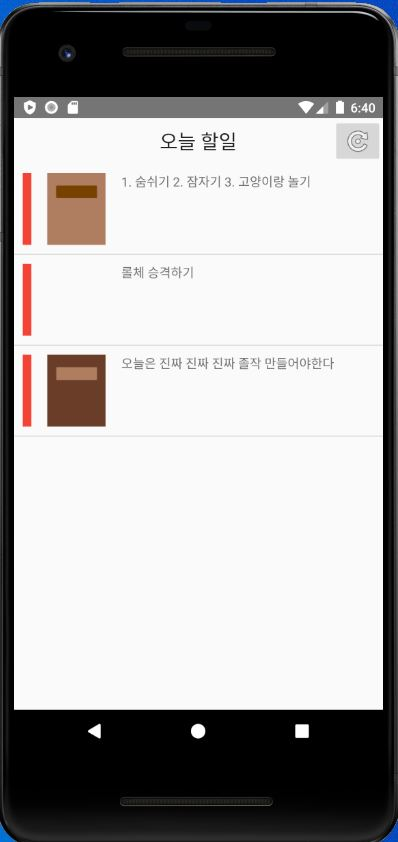

# Skein-of-Heart
## 마음실타래
## 코틀린을 이용한 안드로이드 앱 개발

* 안드로이드 스튜디오 툴을 이용해 개발

## 제작 과정
1. 다이어리 앱 제작
2. 감정 분석 기능 구현

## 다이어리 제작 상황
 
</img>

* 메인 화면
* 로그인 버튼-> 사용자 정보로 변경 예정

</img></img>

* 라이브러리 클릭시 다이어리 화면
* 다이어리 작성 구현 예정
* 다이어리 탭 메뉴 구현 예정
